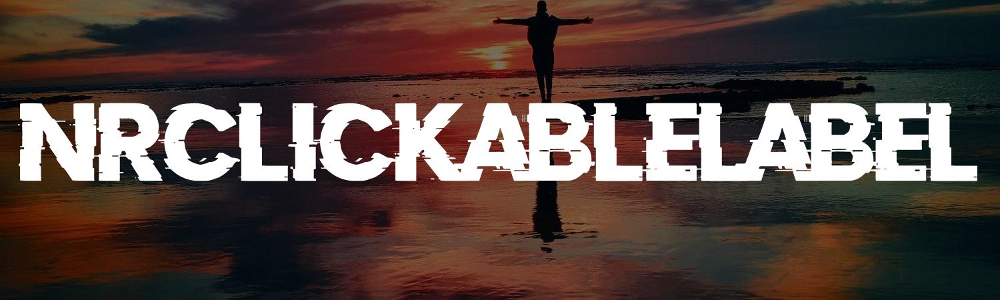

# NRClickableLabel

An easy to use library to create Clickabel Lables in iOS.

### ✨ Demo


## 🦿 Prerequisites

- iOS 10 or above

## ⌨️ Usage

1. Add a UIView in storyboard's / XIB.  
2. Set view's class to -> NRClickableLabel. Create an IBOutlet to this. 
3. Set following properties as per requirement -   
   3.1. arrLinkAttributes -> set link / link color / font / underline color etc  
   3.2. normalTextAttributes -> set font and color for normal text  
   3.3  fullAttributedText -> set full text of label including the linked text.  
4. Now call the process() function. Now you are ready to go. 🎉

## ✍️ Author

👤 **Nalinee**

* Email: nalinee.rajpurohit95@gmail.com

## ❤ Show your support
Give a ⭐️ if this project helped you!

## 📝 License

```
Copyright © 2023 - Nalinee

Licensed under the Apache License, Version 2.0 (the "License");
you may not use this file except in compliance with the License.
You may obtain a copy of the License at

   http://www.apache.org/licenses/LICENSE-2.0

Unless required by applicable law or agreed to in writing, software
distributed under the License is distributed on an "AS IS" BASIS,
WITHOUT WARRANTIES OR CONDITIONS OF ANY KIND, either express or implied.
See the License for the specific language governing permissions and
limitations under the License.
```
